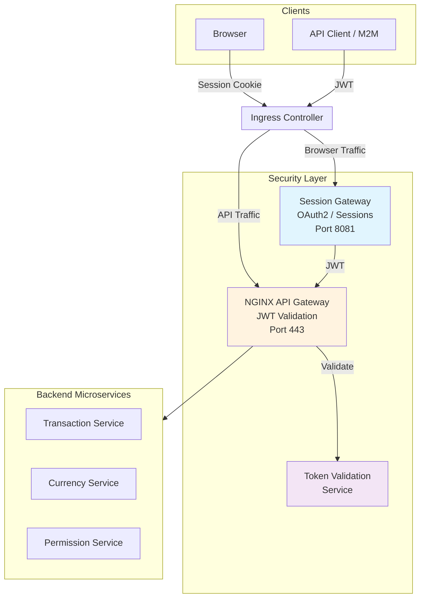

# Budget Analyzer

**Production-grade microservices security infrastructure and ReactJS frontend built with AI-assisted development**

---

## The Story

This project started as a simple re-fresh of my spring boot microservices skills after a 2 year sabbatical.  I wanted to solve a simple problem of reconciling my bank accounts across different countries and currencies, so I figured I'd do a quick microservice + ReactJS frontend and go find a consulting role as I've been doing the last few years.  I was shocked to finish that in a couple weeks after gettting comfortable using Claude Code, so I expanded the scope of the project significantly.  This is a full production grade best practices Backend For Frontend Oauth2 security design for an auditable compliance-oriented financial application.  But really it's just an AI sandbox.  And now I'm excited to go back to building stuff and am looking to help a team integrate AI into their workflow.

:sparkles: *Using **Claude Code**, we rapidly expanded from a basic app to a full enterprise-grade security architecture. The AI didn't just write code—it helped design systems, document decisions, and implement patterns that would typically require a dedicated team.*   (*Claude wrote that*)

So Claude's right, that's exactly it.  I had previously tried using copilot and code assist and was thoroughly unimpressed.  I didn't grok it until i stopped trying to use it as a code assist tool but instead use it as a pair programmer for design and implementation.  We discussed and interated on plans, if you watch the repo I frequently check in plans to give an idea of how detailed they *git*.  I didn't type a line of code in [budget-analyzer-web](https://github.com/budgetanalyzer/budget-analyzer-web), but that is a fully functional ReactJS app using best practices from [bulletproof react](https://github.com/alan2207/bulletproof-react).

I don't really write code anymore, I just design, plan, refine, and code review.  It's easier to just tell Claude to change a variable name because it will rename the variable, fix all the javadocs, and update any random documentation that mentioned the variable name.  I normally have a bunch of terminals all grinding away working on plans in the various services in parallel, it's like a video game.

I think the future is here, and it's pretty exciting.  People aren't into chatbots, neither was I.  Building this project opened my eyes into ways of using and choreographing AI that I hadn't even considered.  It's a pretty exciting time to be alive, I feel like a physicist who was lucky enough to be around in the 1930s and 40s while they were building the bomb.  We don't know where this is gonna take us, but there's no resisting, it's clear this is the path of history.

## Vision

We're building a **pluggable security and authorization infrastructure** that any company can adopt.

The goal isn't just a budget app. It's a reusable foundation that demonstrates:
- Production-ready OAuth2/OIDC authentication
- Server-side session management (BFF pattern)
- JWT validation at the API gateway
- Role-based access control with delegation
- Defense-in-depth security layers

Once these patterns mature, this becomes a template for enterprise applications—drop in your business logic and inherit battle-tested security.

But we're also in parallel figuring out how to use AI on a team.  For example here is a quick plan to figure out the best approach to avoid vendor lock-in for AI service providers: [AI coding assistant abstraction](https://github.com/budgetanalyzer/orchestration/blob/main/docs/development/ai-coding-assistant-configuration-plan.md).  We should be able to swap out and experiment with Gemini and Claude and whatever comes next.  The criticism I keep hearing about using AI for development is that it's great for greenfield projects like this, but it breaks for a real company with a large complex codebase.  My hypothesis is that we simply haven't quite formalized the best practices for doing those migrations, but I think it's possible to introduce these AI development tools into a mature system by starting on leaf nodes and working your way up documenting functionality.  For example create a CLAUDE.md file in a single microservice or piece of the architecture and focus on getting it working well there, and then expand outwards.  I think it's a mistake to try to use a top-down approach introducing these tools.

## Architecture



### Security Layers (Defense in Depth)

| Layer | Component | Responsibility |
|-------|-----------|----------------|
| 1 | **Session Gateway** | OAuth2 flows, HTTP-only cookies, server-side JWT storage |
| 2 | **NGINX API Gateway** | JWT validation, rate limiting, request routing |
| 3 | **Token Validation Service** | Cryptographic signature verification |
| 4 | **Backend Services** | Data-level authorization (user owns resource) |

### Key Security Benefits

- **JWTs never exposed to browser** — Immune to XSS token theft
- **Identity provider abstraction** — Swap Auth0/Okta/Keycloak without client changes
- **Pluggable design** — Security infrastructure meant for reuse across organizations

## AI-Assisted Development

This project demonstrates what's achievable when AI augments development:

- **Architecture design** — Security patterns, component responsibilities, data flows
- **Implementation** — Services, configurations, and integrations
- **Documentation** — Living docs that stay current with the code
- **Code review** — Pattern consistency and security considerations

:sparkles: *The rapid expansion from simple app to enterprise architecture was only possible through AI assistance. This isn't just a showcase—it's a proof point for AI-augmented software development.*

## Technology Stack

| Layer | Technologies |
|-------|-------------|
| **Frontend** | React, TypeScript, Vite |
| **Backend** | Spring Boot, Java 17+, Gradle |
| **Gateway** | NGINX, Spring Cloud Gateway |
| **Auth** | OAuth2/OIDC, Auth0 |
| **Infrastructure** | Docker, PostgreSQL, Redis, RabbitMQ |

## Repositories

| Repository | Purpose |
|------------|---------|
| [orchestration](https://github.com/budgetanalyzer/orchestration) | Docker Compose orchestration and NGINX gateway configuration |
| [session-gateway](https://github.com/budgetanalyzer/session-gateway) | OAuth2 BFF for browser authentication and session management |
| [token-validation-service](https://github.com/budgetanalyzer/token-validation-service) | JWT signature verification for NGINX auth_request |
| [transaction-service](https://github.com/budgetanalyzer/transaction-service) | Financial transactions, accounts, and analytics API |
| [currency-service](https://github.com/budgetanalyzer/currency-service) | Currency management and exchange rates — **Demo service showcasing advanced microservice patterns** |
| [permission-service](https://github.com/budgetanalyzer/permission-service) | Role management and access delegation (RBAC) |
| [budget-analyzer-web](https://github.com/budgetanalyzer/budget-analyzer-web) | React frontend with multi-currency support |
| [service-common](https://github.com/budgetanalyzer/service-common) | Shared Java library for all backend services |
| [basic-repository-template](https://github.com/budgetanalyzer/basic-repository-template) | Template for creating new services |

> **Note:** The `currency-service` serves as our reference implementation. It demonstrates generic patterns commonly needed in production microservices—patterns we're fleshing out to be reusable across services.

## Getting Started

### Prerequisites
- Docker and Docker Compose
- JDK 17+
- Node.js 18+
- [mkcert](https://github.com/FiloSottile/mkcert) (for local HTTPS)

### Quick Start

```bash
# Clone the orchestration repo
git clone https://github.com/budgetanalyzer/orchestration.git
cd orchestration

# Set up local HTTPS certificates
./scripts/dev/setup-local-https.sh

# Start all services
docker compose up -d

# Access the application
# https://app.budgetanalyzer.localhost
```

See the [orchestration repository](https://github.com/budgetanalyzer/orchestration) for detailed setup instructions.

---

## License

This project is licensed under the MIT License.

---

*This is an evolving project demonstrating AI-assisted development. The architecture and patterns continue to mature as we work toward a pluggable security infrastructure.*
