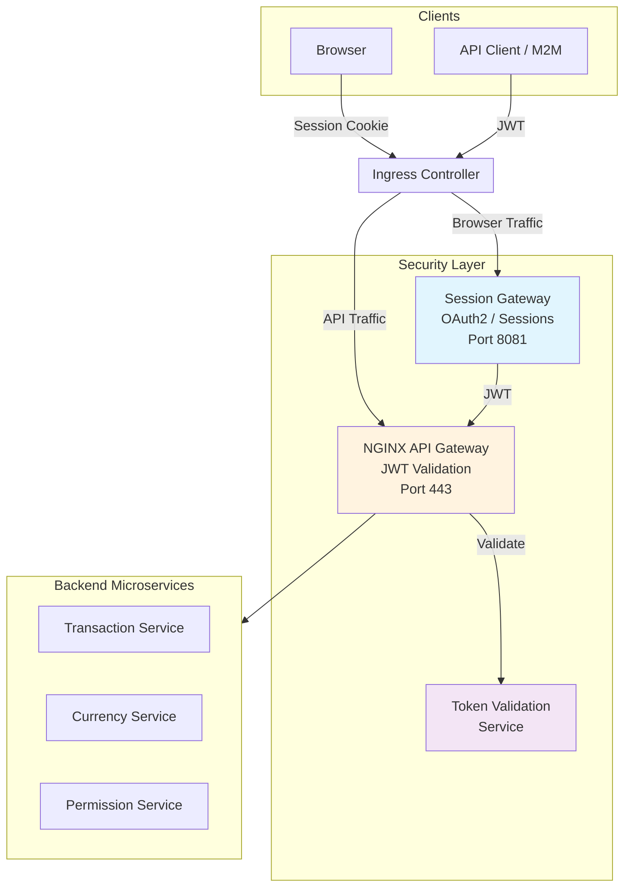

# Budget Analyzer

**Production-grade microservices security infrastructure built with AI-assisted development**

---

## The Story

This project started as a simple personal budget tracker. What changed everything was discovering how powerful AI-assisted development could be.

Using **Claude Code**, we rapidly expanded from a basic app to a full enterprise-grade security architecture. The AI didn't just write code—it helped design systems, document decisions, and implement patterns that would typically require a dedicated team.

## Vision

We're building a **pluggable security and authorization infrastructure** that any company can adopt.

The goal isn't just a budget app. It's a reusable foundation that demonstrates:
- Production-ready OAuth2/OIDC authentication
- Server-side session management (BFF pattern)
- JWT validation at the API gateway
- Role-based access control with delegation
- Defense-in-depth security layers

Once these patterns mature, this becomes a template for enterprise applications—drop in your business logic and inherit battle-tested security.

## Architecture



### Security Layers (Defense in Depth)

| Layer | Component | Responsibility |
|-------|-----------|----------------|
| 1 | **Session Gateway** | OAuth2 flows, HTTP-only cookies, server-side JWT storage |
| 2 | **NGINX API Gateway** | JWT validation, rate limiting, request routing |
| 3 | **Token Validation Service** | Cryptographic signature verification |
| 4 | **Backend Services** | Data-level authorization (user owns resource) |

### Key Security Benefits

- **JWTs never exposed to browser** — Immune to XSS token theft
- **Identity provider abstraction** — Swap Auth0/Okta/Keycloak without client changes
- **Pluggable design** — Security infrastructure meant for reuse across organizations

## AI-Assisted Development

This project demonstrates what's achievable when AI augments development:

- **Architecture design** — Security patterns, component responsibilities, data flows
- **Implementation** — Services, configurations, and integrations
- **Documentation** — Living docs that stay current with the code
- **Code review** — Pattern consistency and security considerations

The rapid expansion from simple app to enterprise architecture was only possible through AI assistance. This isn't just a showcase—it's a proof point for AI-augmented software development.

## Technology Stack

| Layer | Technologies |
|-------|-------------|
| **Frontend** | React, TypeScript, Vite |
| **Backend** | Spring Boot, Java 17+, Gradle |
| **Gateway** | NGINX, Spring Cloud Gateway |
| **Auth** | OAuth2/OIDC, Auth0 |
| **Infrastructure** | Docker, PostgreSQL, Redis, RabbitMQ |

## Repositories

| Repository | Purpose |
|------------|---------|
| [orchestration](https://github.com/budgetanalyzer/orchestration) | Docker Compose orchestration and NGINX gateway configuration |
| [session-gateway](https://github.com/budgetanalyzer/session-gateway) | OAuth2 BFF for browser authentication and session management |
| [token-validation-service](https://github.com/budgetanalyzer/token-validation-service) | JWT signature verification for NGINX auth_request |
| [transaction-service](https://github.com/budgetanalyzer/transaction-service) | Financial transactions, accounts, and analytics API |
| [currency-service](https://github.com/budgetanalyzer/currency-service) | Currency management and exchange rates — **Demo service showcasing advanced microservice patterns** |
| [permission-service](https://github.com/budgetanalyzer/permission-service) | Role management and access delegation (RBAC) |
| [budget-analyzer-web](https://github.com/budgetanalyzer/budget-analyzer-web) | React frontend with multi-currency support |
| [service-common](https://github.com/budgetanalyzer/service-common) | Shared Java library for all backend services |
| [basic-repository-template](https://github.com/budgetanalyzer/basic-repository-template) | Template for creating new services |

> **Note:** The `currency-service` serves as our reference implementation. It demonstrates generic patterns commonly needed in production microservices—patterns we're fleshing out to be reusable across services.

## Getting Started

### Prerequisites
- Docker and Docker Compose
- JDK 17+
- Node.js 18+
- [mkcert](https://github.com/FiloSottile/mkcert) (for local HTTPS)

### Quick Start

```bash
# Clone the orchestration repo
git clone https://github.com/budgetanalyzer/orchestration.git
cd orchestration

# Set up local HTTPS certificates
./scripts/dev/setup-local-https.sh

# Start all services
docker compose up -d

# Access the application
# https://app.budgetanalyzer.localhost
```

See the [orchestration repository](https://github.com/budgetanalyzer/orchestration) for detailed setup instructions.

---

## License

This project is licensed under the MIT License.

---

*This is an evolving project demonstrating AI-assisted development. The architecture and patterns continue to mature as we work toward a pluggable security infrastructure.*
