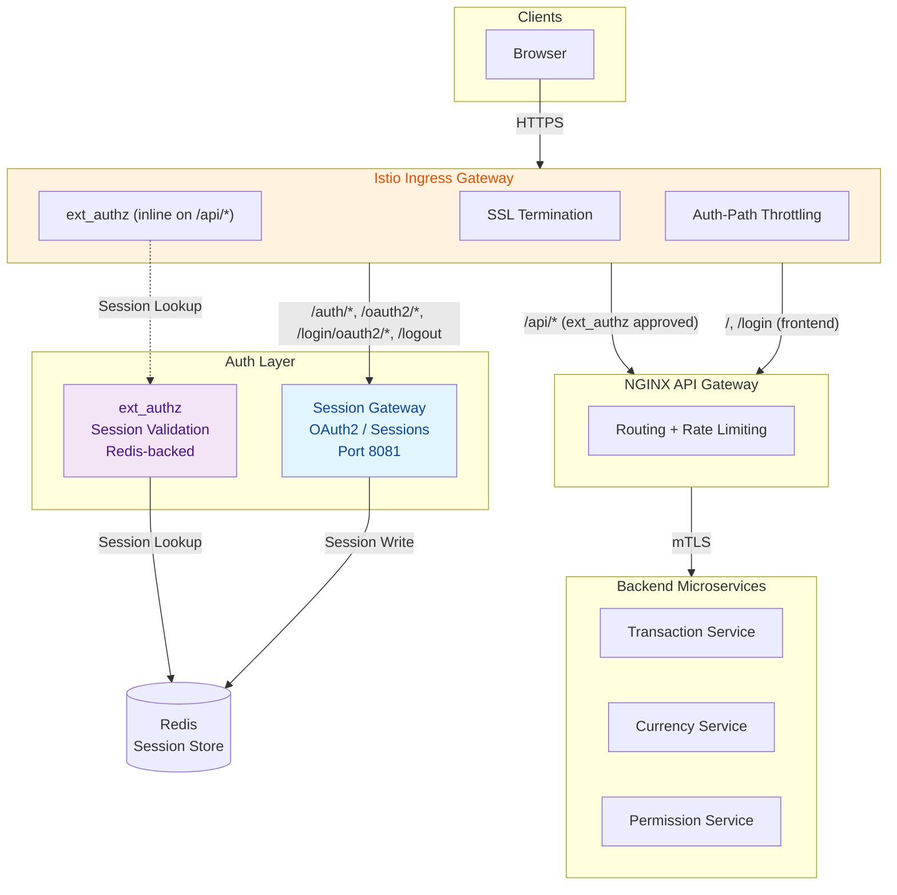

# Budget Analyzer

[](https://opensource.org/licenses/MIT)

**Production-grade microservices security infrastructure demonstrating session-based edge authorization, OAuth2/OIDC authentication, and Kubernetes-native development workflows.**

[Demo App](https://demo.budgetanalyzer.org) | [API Documentation](https://demo.budgetanalyzer.org/api-docs)

---

## Overview

A multi-repo reference application built to exercise modern backend security patterns in a production-style environment. The actual domain (personal finance) is deliberately simple — the focus is on infrastructure, security boundaries, and platform workflow.

**Core technical areas:**
- Session-based edge authorization with opaque tokens (no JWTs exposed to browser)
- OAuth2/OIDC authentication with server-side session management
- Per-request session validation via Istio ext_authz and Redis
- Kubernetes-native local development with live reload and full mTLS
- Defense-in-depth security layers from ingress to backend

## Start Here

| Repository | What it demonstrates |
|------------|---------------------|
| [session-gateway](https://github.com/budgetanalyzer/session-gateway) | OAuth2 flows, session management, ext_authz validation — the core security implementation |
| [currency-service](https://github.com/budgetanalyzer/currency-service) | Reference Spring Boot service — scheduled jobs with ShedLock, RabbitMQ with transactional outbox (Spring Modulith), Redis caching, OpenAPI, Flyway, provider abstraction |
| [orchestration](https://github.com/budgetanalyzer/orchestration) | Kubernetes local dev environment, Istio ingress, NGINX gateway, infrastructure-as-code |

To run the full stack: clone [workspace](https://github.com/budgetanalyzer/workspace) and open in VS Code Dev Containers.

## Architecture


```mermaid
flowchart TB
    subgraph Clients
        Browser[Browser]
    end

    subgraph Ingress["Istio Ingress Gateway"]
        direction LR
        SSL[SSL Termination]
        EXT["ext_authz (inline on /api/*)"]
        THROTTLE[Auth-Path Throttling]
    end

    subgraph Auth["Auth Layer"]
        SG[Session Gateway<br/>OAuth2 / Sessions<br/>Port 8081]
        EA[ext_authz<br/>Session Validation<br/>Redis-backed]
    end

    subgraph Routing["NGINX API Gateway"]
        direction LR
        ROUTE[Routing + Rate Limiting]
    end

    subgraph Services["Backend Microservices"]
        TS[Transaction Service]
        CS[Currency Service]
        PS[Permission Service]
    end

    Redis[(Redis<br/>Session Store)]

    Browser -->|HTTPS| Ingress
    Ingress -->|"/auth/*, /oauth2/*, /login/oauth2/*, /logout"| SG
    Ingress -->|"/api/* (ext_authz approved)"| Routing
    Ingress -->|"/, /login (frontend)"| Routing
    EXT -.->|Session Lookup| EA
    EA -->|Session Lookup| Redis
    SG -->|Session Write| Redis
    Routing -->|mTLS| Services

    style SG fill:#e1f5fe,color:#0d47a1
    style EA fill:#f3e5f5,color:#4a148c
    style Ingress fill:#fff3e0,color:#e65100
```

### Security Layers

| Layer | Component | Responsibility |
|-------|-----------|----------------|
| 1 | **Istio Ingress Gateway** | SSL termination, ext_authz enforcement, auth-path throttling |
| 2 | **Session Gateway** | OAuth2 flows, HTTP-only cookies, session lifecycle |
| 3 | **ext_authz** | Per-request session validation via Redis, header injection |
| 4 | **Backend Services** | mTLS-enforced access (Istio STRICT), data-level authorization |

**Key design decisions:**
- Tokens never exposed to browser — immune to XSS token theft
- Instant session revocation — Redis key delete terminates access immediately
- Identity provider abstraction — swap Auth0/Okta/Keycloak without client changes

## Local Development

Live reload in Kubernetes without sacrificing production fidelity. Code changes reach running pods in seconds while Istio mTLS, Calico network policies, and ext_authz validation stay active.

| Stack | Inner-loop mechanism |
|-------|---------------------|
| **Java (Spring Boot)** | Gradle compiles on host, Tilt syncs JAR into pod, process restarts |
| **React (Vite)** | Tilt syncs source files, Vite HMR hot-patches browser |
| **Shared library** | `service-common` changes cascade to downstream services automatically |

See [local environment docs](https://github.com/budgetanalyzer/orchestration/blob/main/docs/development/local-environment.md) for setup details.

## Technology Stack

| Layer | Technologies |
|-------|-------------|
| **Frontend** | React, TypeScript, Vite |
| **Backend** | Spring Boot, Java 24+, Gradle |
| **Gateway** | Istio Ingress Gateway, NGINX |
| **Auth** | OAuth2/OIDC, Auth0 |
| **Infrastructure** | Kubernetes (Kind), Tilt, Istio, Calico, Docker, PostgreSQL, Redis, RabbitMQ |

## All Repositories

| Repository | Purpose |
|------------|---------|
| [session-gateway](https://github.com/budgetanalyzer/session-gateway) | OAuth2 authentication, session management, ext_authz validation |
| [orchestration](https://github.com/budgetanalyzer/orchestration) | Tilt + Kind environment, Istio ingress, NGINX configuration |
| [transaction-service](https://github.com/budgetanalyzer/transaction-service) | Financial transactions, accounts, analytics API |
| [currency-service](https://github.com/budgetanalyzer/currency-service) | Reference Spring Boot service with production patterns |
| [permission-service](https://github.com/budgetanalyzer/permission-service) | Role management and access delegation |
| [budget-analyzer-web](https://github.com/budgetanalyzer/budget-analyzer-web) | React frontend |
| [service-common](https://github.com/budgetanalyzer/service-common) | Shared Java library for backend services |
| [workspace](https://github.com/budgetanalyzer/workspace) | Devcontainer entry point |

## Development Approach

Built with AI-assisted development using Claude Code and Codex. Architecture decisions, implementation, and documentation were developed iteratively with AI as a collaborative tool.

---

## Quickstart

**Prerequisites**: VS Code with [Dev Containers extension](https://marketplace.visualstudio.com/items?itemName=ms-vscode-remote.remote-containers), Docker

```bash
git clone https://github.com/budgetanalyzer/workspace
```

Open in VS Code → "Reopen in Container" → Follow [Getting Started](https://github.com/budgetanalyzer/orchestration/blob/main/docs/development/getting-started.md)

---

## License

MIT
